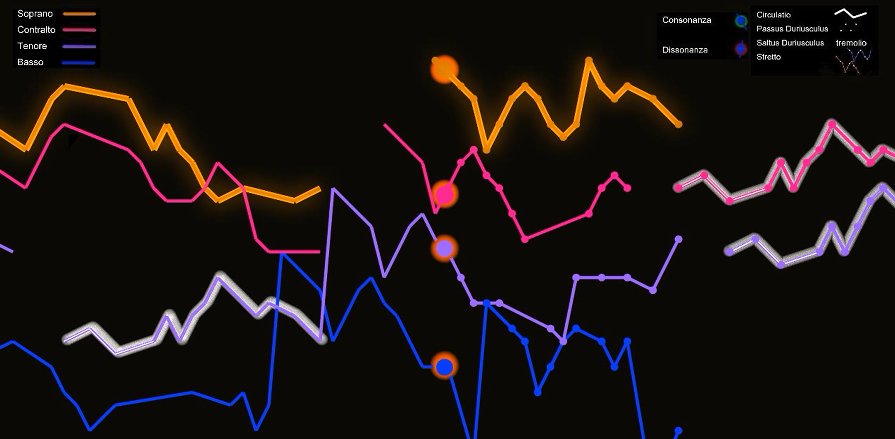
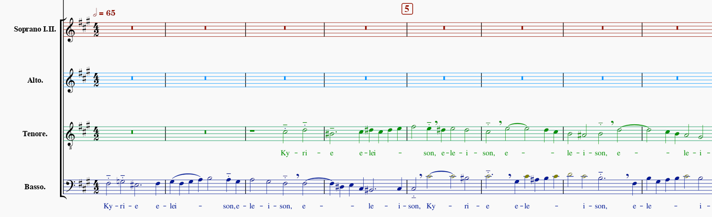
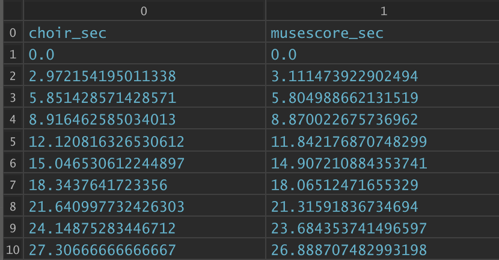
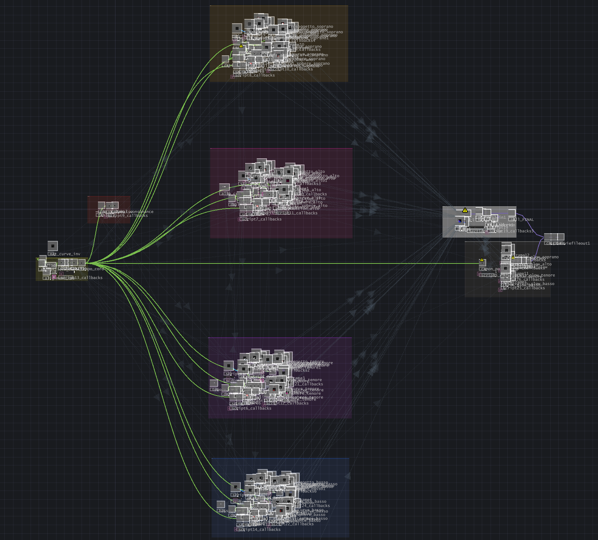
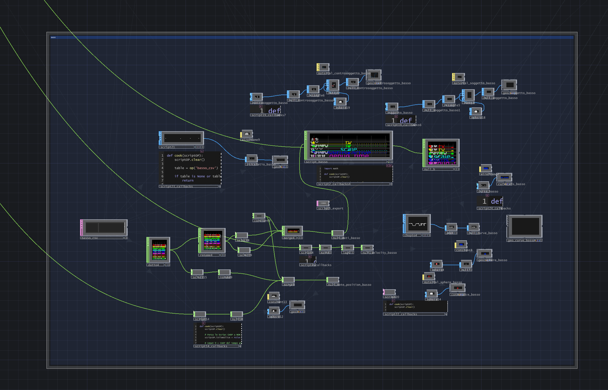

# L19 – Seeing the Unheard  
## Visualizing the Architecture of Bach’s *Mass in B minor*

This repository contains the Python scripts and TouchDesigner project developed for **Seeing the Unheard**, a music visualization system based on the *Kyrie II* from J. S. Bach’s *Mass in B minor*.

The project aims to make Bach’s contrapuntal writing more accessible by translating musical structures into a synchronized generative visualization. Melodic trajectories, fugal subject entries, countersubject-like passages, harmonic tension, rhetorical figures, and formal sections are mapped into animated curves, moving spheres, halos, color changes, and textual annotations.

The system combines:

- symbolic music analysis from a MusicXML score;
- audio-to-audio synchronization using Dynamic Time Warping;
- real-time generative rendering in TouchDesigner.

---

## Preview



The final visualization represents the four vocal parts as color-coded melodic trajectories in a pitch-time space, with moving spheres, halos, and analytical highlights synchronized with the choir recording.


## Demo video

[](https://youtu.be/jIAINrTFMF8)

The demo shows the final synchronized audiovisual output of the project, where the choir recording drives the TouchDesigner visualization of Bach’s *Kyrie II*.

---

## Repository structure

```text
L19/
│
├── Visualization TouchDesigner/
│   └── TouchDesigner project and CSV files used for the final visualization
│
├── musical data extraction/
│   ├── code/
│   │   ├── data_extraction.py
│   │   ├── harmonic_consonance_extraction.py
│   │   ├── melodic_consonance_extraction.py
│   │   ├── musical_analysis.py
│   │   └── notes_data_extraction.py
│   │
│   └── data/
│       └── kyrieII.mxl
│
├── timewarp/
│   ├── timewarp.py
│   ├── musescore.wav
│   └── coro.wav
│
└── README.md
```

---

## Project description

The Python pipeline extracts musical information from a MusicXML score of the *Kyrie II*, including note-level data, melodic lines, subject entries, contrapuntal structures, rhetorical figures, and consonance-related information.

The project also includes a temporal alignment pipeline. Since the visualization was originally built on a MuseScore reference audio, while the final output uses a real choir recording, the two audio files are aligned using chroma features and Dynamic Time Warping. The resulting alignment table allows TouchDesigner to follow the expressive timing of the choir while keeping the score-based musical data synchronized.

The extracted CSV files are then imported into TouchDesigner, where they drive the generative visualization. Each voice is represented as a melodic trajectory in a pitch-time space, with additional visual elements highlighting the internal structure of the fugue.

---

## How to use the project

The `Visualization TouchDesigner` folder already contains the CSV files required to run the TouchDesigner project. The file references inside the TouchDesigner network are already set up.

If the project is opened from the same folder structure, the visualization should work without regenerating the data.

If a new generation of the CSV files is needed, follow the instructions below.

---

## 1. Musical analysis data extraction

To regenerate the musical analysis CSV files, run:

```bash
python data_extraction.py
```

from the following directory:

```text
musical data extraction/code
```

Before running the script, make sure that:

```text
kyrieII.mxl
```

is located in:

```text
musical data extraction/data
```

The following scripts must be located in:

```text
musical data extraction/code
```

```text
harmonic_consonance_extraction.py
melodic_consonance_extraction.py
musical_analysis.py
notes_data_extraction.py
data_extraction.py
```

The generated CSV files are used by the TouchDesigner project to control the visual behavior of the four vocal parts and the analytical highlights.


### Score excerpt



The symbolic analysis starts from the MusicXML score of the *Kyrie II*. The extracted data describe note-level information, melodic trajectories, subject entries, rhetorical figures, and consonance-related features.

---

## 2. Time alignment with DTW

To regenerate the alignment table, run:

```bash
python timewarp.py
```

from the following directory:

```text
timewarp
```

Before running the script, make sure that the following audio files are in the same directory as `timewarp.py`:

```text
musescore.wav
coro.wav
```

The script produces an alignment CSV file that maps the timing of the real choir recording to the MuseScore reference timeline.

This file is used inside TouchDesigner to synchronize the visualization with the choir audio.


### DTW alignment



The alignment table maps each time position of the real choir recording to the corresponding position in the MuseScore reference audio, allowing the visualization to follow the expressive timing of the performance.

---

## 3. TouchDesigner setup

The TouchDesigner project is contained in:

```text
Visualization TouchDesigner
```

This folder already includes the required CSV files, and the corresponding File DATs inside TouchDesigner are already linked.

The main external inputs are:

```text
audiofilein_coro          → choir audio file
consonance_csv            → harmonic_consonance.csv
alignment_csv             → DTW alignment CSV
basso_csv                 → Bass voice CSV
tenore_csv                → Tenor voice CSV
alto_csv                  → Alto voice CSV
sopranoii_csv               → Soprano voice CSV
```

Each voice CSV drives the corresponding melodic curve, moving sphere, note markers, subject highlights, and voice-specific visual parameters.

If the links are broken after moving the project to another computer, reload the files manually in the corresponding TouchDesigner operators.


### TouchDesigner network



The TouchDesigner network imports the CSV files generated by the Python pipeline and maps them to curves, moving spheres, halos, visual effects, and textual overlays.

### Voice pipeline example



Each vocal part follows a similar processing pipeline. The voice CSV is parsed and transformed into melodic curves, note markers, moving spheres, subject highlights, and voice-specific visual parameters.

---

## Visual mapping

The visualization represents the fugue as a pitch-time space:

- the horizontal axis represents musical time;
- the vertical axis represents pitch height;
- each vocal part is represented by a distinct colored melodic trajectory;
- moving spheres follow the active notes of each voice;
- halos react to harmonic consonance and dissonance;
- subject entries and countersubject-like passages are highlighted;
- rhetorical figures such as *circulatio*, *passus duriusculus*, and *saltus duriusculus* are translated into specific visual behaviors;
- formal sections are displayed through textual labels and overlays.

The goal is not to replace musical analysis, but to create a visual listening aid that helps non-specialist listeners follow the architecture of Bach’s polyphony.

---

## Requirements

The Python scripts require a standard Python environment with the libraries used for symbolic music processing, audio analysis, and CSV generation.

Main libraries include:

```text
music21
librosa
numpy
pandas
scipy
soundfile
```

Install the required packages with:

```bash
pip install music21 librosa numpy pandas scipy soundfile
```

TouchDesigner is required to run the visualization project.

The project was developed and tested in TouchDesigner (2025.32820). If using a different TouchDesigner version, some operators or callbacks may require minor adjustments. 

---

## Output

The final output is a synchronized audiovisual visualization of the *Kyrie II*, where the structure of the fugue is translated into a real-time visual environment.

The system is intended as a support tool for listening, analysis, and educational or audiovisual presentation contexts.

---

## Authors

Project L19  
Politecnico di Milano – MAE Capstone Course

Andrea Casati  
Alessandro Catalano  
Anna Venier

---

## Acknowledgements

The musical and structural analysis of the *Kyrie II* was supported by the analytical brief provided by Maestro Giorgio Brenna for the Discanto Vocal Ensemble / Politecnico di Milano project.

---

## License

This repository is intended for academic and educational purposes.
